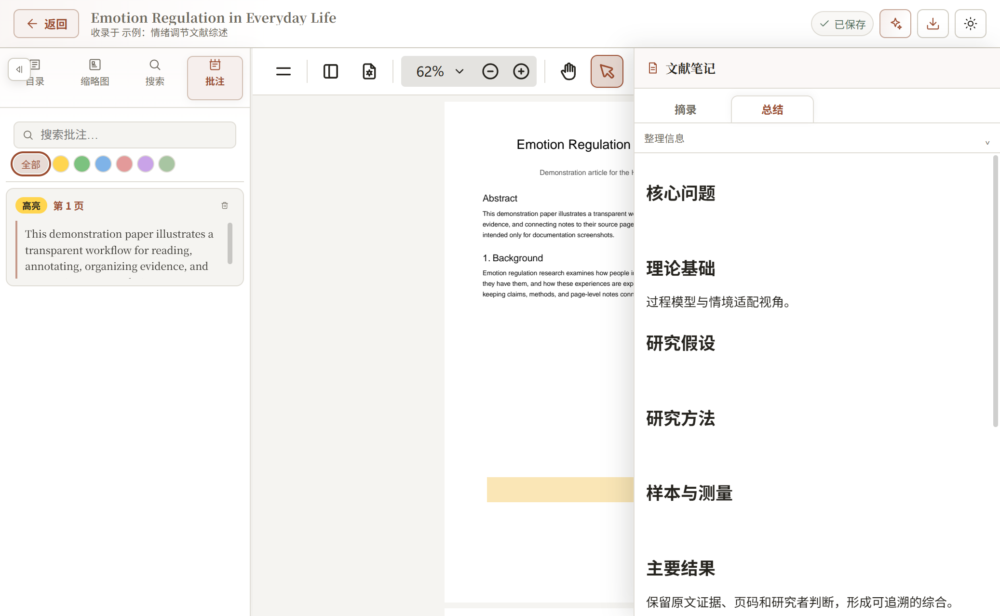
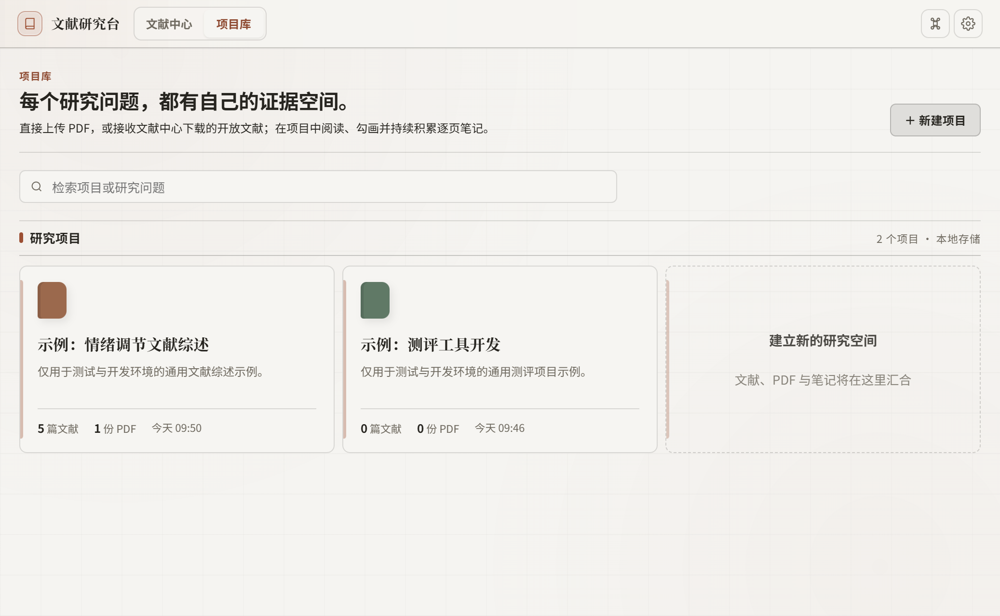
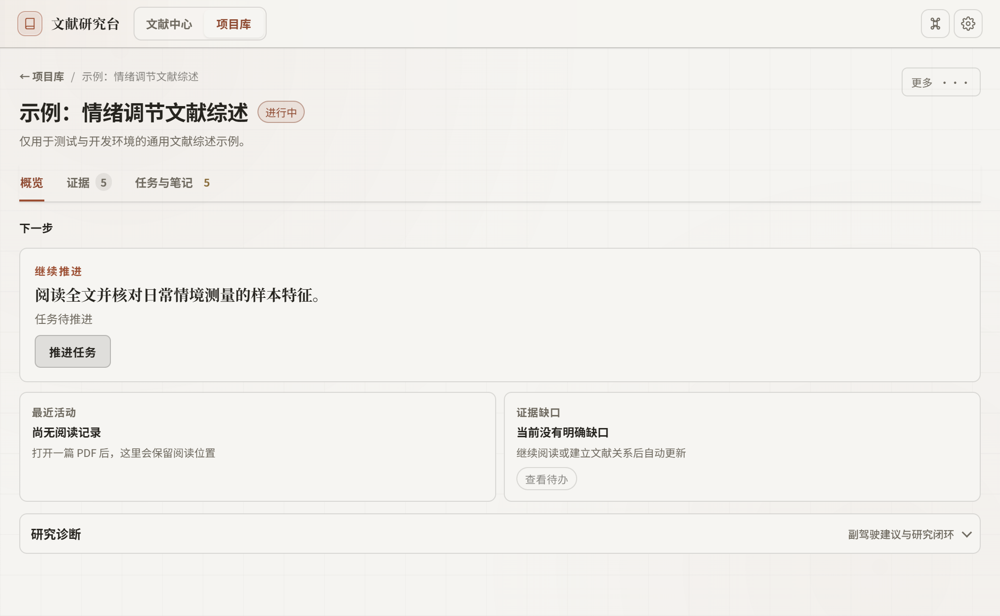
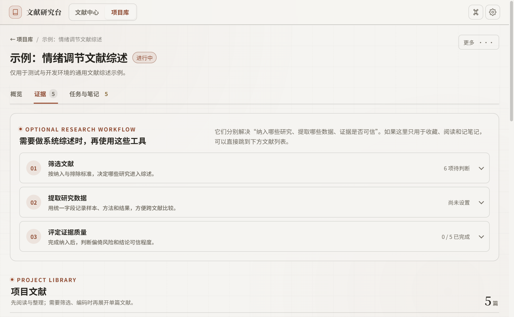

# DSH Hana Research

<p align="center">
  <strong>A local-first literature workspace for psychology and social-science research</strong><br />
  Discover papers, read and annotate PDFs, organize evidence, conduct systematic reviews, and collaborate with a DeepSeek Harness agent.
</p>

<p align="center">
  <a href="https://github.com/zhoupengyun572-cell/dsh-hana-research/releases/tag/v0.5.0-beta.1"></a>
  <a href="https://github.com/zhoupengyun572-cell/dsh-hana-research/actions/workflows/ci.yml"></a>
  <a href="LICENSE"></a>
  
  
</p>

<p align="center">
  <a href="README.md">中文</a> · <b>English</b> ·
  <a href="docs/USER_GUIDE.md">User guide (Chinese)</a> ·
  <a href="https://github.com/zhoupengyun572-cell/dsh-hana-research/issues">Issues</a>
</p>



> [!IMPORTANT]
> `0.5.0-beta.1` targets the DeepSeek Harness developer preview. The full workflow has been validated on Windows; automated CI covers Ubuntu/Windows with Node.js 22 and 24.

## What it does

Hana Research keeps literature discovery, PDFs, notes, screening decisions, and evidence exports in one traceable workspace:

1. Search OpenAlex, Crossref, arXiv, and PubMed, or upload a local PDF.
2. Create a project for each research question so papers, tasks, and notes have a clear home.
3. Read in a three-pane PDF workspace where annotations and researcher interpretations remain linked to a page.
4. Expand systematic-review tools only when needed: two-stage screening, PRISMA, structured coding, risk of bias, and GRADE.
5. Export notes, evidence matrices, citations, and annotated PDFs, or hand the current structured context to a Harness agent.

## Capability map

| Stage | Capabilities |
|---|---|
| Discovery | Four-source search, AI interpretation, saved searches, new-result alerts, journal monitoring |
| Organization | Project libraries, paper roles, reading status, priorities, tasks, cross-paper relations |
| Reading | Outline/thumbnails/search, colored annotations, page-linked excerpts, reading progress, structured summaries |
| Systematic review | Inclusion/exclusion criteria, title/abstract and full-text screening, dual review, conflict resolution, PRISMA 2020 |
| Evidence synthesis | Custom extraction fields, RoB 2 / ROBINS-I, GRADE, evidence matrices, argument links |
| Export and agent work | Markdown, DOCX, PDF, CSV, XLSX, BibTeX, RIS, plus 20 Harness agent tools |

The systematic-review modules use progressive disclosure. You can skip them when you only need a paper library, reader, and notes.

## Product tour

<table>
  <tr>
    <td width="50%" valign="top">
      <br />
      <sub><b>Project library</b> — one evidence space for each research question.</sub>
    </td>
    <td width="50%" valign="top">
      <br />
      <sub><b>Project overview</b> — the next action, recent activity, and evidence gaps without a crowded dashboard.</sub>
    </td>
  </tr>
  <tr>
    <td width="50%" valign="top">
      <br />
      <sub><b>Evidence workflow</b> — reveal screening, extraction, and quality assessment only when needed.</sub>
    </td>
    <td width="50%" valign="top">
      <br />
      <sub><b>Reader workspace</b> — source text, annotations, and structured literature notes stay together.</sub>
    </td>
  </tr>
</table>

The screenshots use a synthetic demonstration PDF and public bibliographic metadata. They contain no private user projects or research data. The current UI is Chinese-first.

## Install

Install [DeepSeek Harness](https://github.com/deepseek-ai/deepseek-harness) first, then pin the plugin to the published tag:

```powershell
dsh plugin --profile web add github:zhoupengyun572-cell/dsh-hana-research#v0.5.0-beta.1
```

Restart Harness after installation. The packaged `dsh.bundle` activates Hana Research in the `web` profile without manual configuration edits.

The same package is available from the [GitHub Release](https://github.com/zhoupengyun572-cell/dsh-hana-research/releases/tag/v0.5.0-beta.1). SHA-256:

```text
437495d420fdff5268d8fb5431a06b8f7afcb7702ae4aa7133531f6bd9b2a8e7
```

Update or remove it with:

```powershell
dsh plugin --profile web update dsh-hana-research
dsh plugin --profile web remove dsh-hana-research
```

Removing the package does not delete the research database.

## Data and security

- Data stays under `$DSH_HOME/plugin-data/hana-research/`: SQLite `research.db`, PDFs, translations, and project-note files.
- The current database is **schema v22**. Migrations preserve a snapshot when required.
- A new installation starts empty; author projects and demonstration papers are never seeded by default.
- Agent write tools require user confirmation and remain subject to Harness approval and local audit records.
- Network destinations, PDF download restrictions, and remaining dependency risks are documented in [SECURITY.md](SECURITY.md).

## Compatibility and limitations

- Node.js `>=22.13.0`; Harness baseline `@deepseek-ai/dsh-tools 0.1.0-rc.13`, with public CI against `0.1.1-rc.2`.
- Windows has completed the install/read/annotate/export/update/remove workflow. Ubuntu currently has automated CI coverage but no full GUI acceptance pass.
- The UI is currently Simplified Chinese-first.
- DeepSeek Harness remains a developer preview, so compatibility across every preview build is not guaranteed.

## Documentation

- [User guide](docs/USER_GUIDE.md) — quick start, workflows, feature tree, FAQ, backup and recovery (Chinese)
- [Plugin overview](docs/PLUGIN_OVERVIEW.md) — architecture, capabilities, data model, APIs, and agent tools (Chinese)
- [Changelog](CHANGELOG.md)
- [Security policy](SECURITY.md)
- [Contributing](CONTRIBUTING.md)
- [Third-party notices](THIRD_PARTY_LICENSES.md)

## Development

```powershell
npm ci
node scripts/run-tests.mjs

cd web
npm ci
node --test tests/*.test.mjs
npm run build
```

The current baseline is 167/167 root tests and 13/13 reader-editor tests. CI also verifies the release-package allowlist and size budget.

## Support and contribution

- [Report a bug](https://github.com/zhoupengyun572-cell/dsh-hana-research/issues/new?template=bug_report.yml)
- [Request a feature](https://github.com/zhoupengyun572-cell/dsh-hana-research/issues/new?template=feature_request.yml)
- For vulnerabilities, follow [SECURITY.md](SECURITY.md) and do not disclose sensitive details in a public issue.

Please include the Harness and Node versions, operating system, reproduction steps, and sanitized logs when reporting a problem.

## License

[MIT](LICENSE) © 2026 Hana Research contributors
