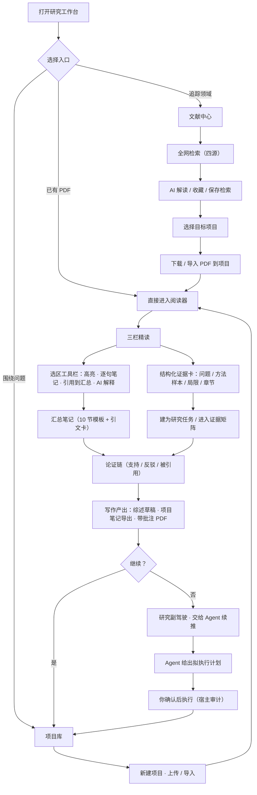
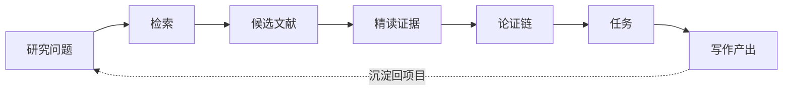
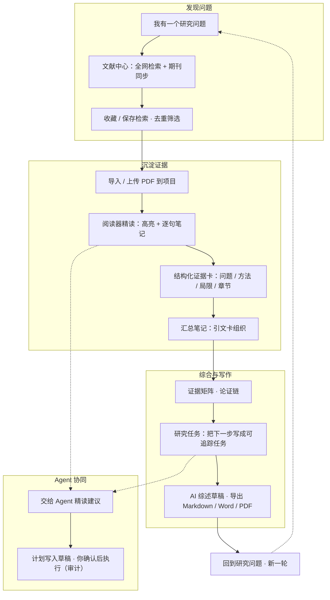

# Hana Research · DSH 插件使用说明书

> 面向心理学研究工作者的本地学术工作台。本文档既是**插件介绍**，也是**使用说明**；文末附**整体工作流程图与功能树形图**。
> 版本：0.5.0-beta.1 发布准备版（数据库 schema v22）。标记 ⚠️ 的分节代表需要在思维完备后人工确认的安全/边界项。

---

## 1. 插件是什么

**Hana Research（HanaResearch）** 是运行在 DeepSeek Harness 里的一个研究插件：把「文献发现 → 项目积累 → PDF 精读 → 证据提取 → 论证构建 → 写作推进」串成一条可追溯的闭环，让研究者把精力放在判断上，而不是放在管理文件上。

### 1.1 设计理念

- **本地优先**：所有文献元数据、PDF、批注、笔记、任务、审计记录都保存在本地 SQLite 数据库与文件目录中，不依赖云端账号；文件的来源、哈希、导入时间都可追溯。
- **不替你做判断**：Agent 只提供候选解释与拟执行计划；创建任务、修改项目、完成任务等写入操作一律由你确认，并经过 Harness 审批与审计。
- **界面只服务于下一步**：不是把所有信息堆给你看，而是始终帮助你判断「接下来该做什么」（研究驾驶舱的「下一步」卡片与「研究副驾驶」）。
- **温暖、安静、克制的学术编辑台**：动效只表达状态变化（保存、完成、Agent 整理中），支持系统「减弱动态效果」设置与插件内「动效强度」覆盖。

### 1.2 核心原则（写入每一次 Agent 交接）

- Agent 引用本地证据保留「文献标题 / DOI / 页码 / 标签」；没有 PDF 或笔记时明确说明，绝不把元数据说成已读全文。
- Agent 的读操作可主动使用；**写操作必须确认且经宿主审计**；接力内容写入对话草稿，由你确认后才发送。

### 1.3 三个主要界面入口

| 界面 | 地址 | 作用 |
|---|---|---|
| 文献中心 | `/ui/hana-research/literature` | 全网检索、期刊同步、收藏、导入项目 |
| 项目库 | `/ui/hana-research/projects` | 研究项目、研究驾驶舱、任务与证据 |
| 阅读器 | `/ui/hana-research/reader?projectId=…&attachmentId=…` | 三栏 PDF 精读工作台（从项目抽屉进入） |

---

## 2. 快速上手（3 步走完一个最小闭环）

1. **建项目**：打开「项目库」→ 新建项目（可设置默认项目）→ 打开项目，点「上传 PDF 到项目」或从文献中心导入。
2. **精读**：项目证据页点「打开阅读器」→ 选中文字，用选区工具栏「高亮 / 添加逐句笔记 / 引用到汇总 / AI 解释」；在逐句卡里补「我的理解」与「结构化证据」（问题 / 方法样本 / 局限 / 可用章节）。
3. **推进**：回到项目概览，看「下一步」与「研究副驾驶」建议 → 把证据卡「建为研究任务」或在汇总笔记里组织引文卡 → 需要时「交给 Agent」让 AI 依据真实数据给出计划（你确认后执行）。

---

## 3. 整体工作流程（先看图）

### 3.1 研究主流程（Mermaid；支持的 Markdown 查看器可渲染）



### 3.2 研究闭环（七个阶段 · 也是驾驶舱里的可视化）



- 每个阶段显示**真实数量 / 完成度**；无法计算的阶段明确显示「尚未建立关联」，不伪造进度。
- 在项目概览的「研究闭环」里点击任一阶段，会跳转到对应界面（检索→文献中心；候选文献/精读证据/论证链→项目证据页；任务→项目任务页）。

### 3.3 功能树形图（ASCII，任何环境可读）

```
HanaResearch
├─ 文献中心
│  ├─ 学术检索：四源（OpenAlex / Crossref / arXiv / PubMed）+ AI 解读
│  ├─ 保存检索 / 一键重跑 / 新结果提醒
│  ├─ 期刊同步：内置源 + 自定义期刊源 + AI 期刊简报
│  ├─ 收藏 / 文献集合 / 主题·状态·方法学筛选
│  └─ 文献操作：阅读状态 / P0-P2 优先级 / 方法学标注 / 导出(RIS·BibTeX) / 相似推荐 / 引文网络
├─ 项目研究驾驶舱（抽屉·三页签）
│  ├─ 概览：下一步卡（最重要任务 · 证据缺口 · 最近阅读 · 继续推进）
│  │       + 研究副驾驶（≤3 条真实数据建议） + 研究闭环可视化
│  ├─ 证据：文献卡 · 角色标记（核心/背景/方法参考/结果对比） · 论证链 · 证据矩阵
│  └─ 任务与笔记：研究任务面板 / 项目笔记（跨文献关联）
├─ 阅读工作台（三栏 Zotero 式）
│  ├─ 左：文档目录 / 缩略图 / 全文搜索 / 批注列表
│  ├─ 中：EmbedPDF 渲染 · 选区工具栏（复制 · 高亮 · 下划线 · 删除线 · 分节
│  │       · 添加逐句笔记 · 引用到汇总 · AI 解释）
│  └─ 右：逐句笔记 / 汇总笔记（Tiptap · 分类标签 · 引文卡一键跳回）
├─ 证据与写作
│  ├─ 结构化证据卡：研究问题·方法样本·局限·可用章节
│  ├─ 逐句 → 汇总（引文 = 摘录 + 我的理解 + 分类标签）
│  ├─ 证据矩阵（研究问题 × 文献） / 论证关系（支持 · 反驳 · 被引用）
│  ├─ AI 综述草稿 / 全文翻译（生成译文子文档，段级缓存）
│  └─ 导出：项目笔记 Markdown / Word / PDF · 引用 RIS / BibTeX · 带批注 PDF
├─ Agent 协作
│  ├─ 「交给 Agent」入口：阅读器 · 检索页 · 项目页 · 任务面板 · 副驾驶
│  ├─ 研究副驾驶：查看依据 / 交给 Agent / 暂不处理
│  ├─ 对话卡片：项目摘要 / 期刊简报 / 项目概览 / 检索结果
│  └─ 安全：只读可主动用 · 写入需确认 + 宿主审计 · 接力进草稿由你发送
└─ 设置与个性化（顶栏齿轮）
   ├─ 专注模式 / 信息密度 / 动效强度（支持系统减弱动态）
   ├─ 默认项目 · Agent 写操作策略
   ├─ 快捷键：Ctrl/⌘K · Alt 1·2·3 · N · Esc
   └─ 全部本地保存，不影响数据库
```

---

## 4. 模块详解与使用说明

### 4.1 文献中心（发现与搜集）

**检索**：顶部「学术检索」输入关键词 → 检索。支持四源并发；结果可：
- 「AI 解读」：用宿主模型给出简明概括。
- 「收藏」：加入收藏。
- 「保存检索」：命名保存，之后可一键重跑并开启「新结果提醒」（重跑时高亮上次之后的新结果）。
- 「下载并导入」：一键把开放 PDF 下载进右侧「目标项目」。

**期刊同步**：期刊更新栏显示最近同步状态；「管理」菜单 / 期刊栏按钮可「立即同步全部期刊」「添加自定义期刊源」「生成 AI 期刊简报」。

**整理文献**：每篇文献卡支持阅读状态（未读/在读/已读）、优先级（P0 最重要）、方法学标注（实验/相关/纵向/元分析等）、加入文献集合、导出单篇 BibTeX、相似文献推荐、引文网络浏览。

> ⚠️ 说明：检索/推荐/引文是实时联网接口，慢网络下弹窗内「正在读取…」属正常；下载 PDF 仅走开放获取 / 官网直连等合法接口。

### 4.2 项目研究驾驶舱（组织与推进）

打开项目库 → 点击项目卡进入抽屉，抽屉顶部为**三个页签**：

- **概览**：
  - 「下一步」卡片（可折叠）：显示最重要的待推进任务、当前证据缺口、最近阅读位置，以及一个明确主操作（继续阅读 N 页 / 推进任务 / 精读补证据 / 上传 PDF）。
  - 「研究副驾驶」：基于真实数据给出最多 3 条建议（逾期/高优任务、有 PDF 无笔记的证据缺口、今日推进顺序）；每条有「查看依据」弹窗、「交给 Agent」、「暂不处理」。
  - 「研究闭环」：7 阶段可视化，点击跳转。
  - 常用操作：上传 PDF、生成综述草稿、证据矩阵、导出笔记。
- **证据**：项目文献列表 + 角色标记/筛选 + 论证链（关系增删）+ 证据矩阵入口 + 译文展开。
- **任务与笔记**：研究任务面板（新增/优先级/截止/关联文献/完成重开/筛选）+ 项目笔记（可关联另一篇文献作跨文献对比）。

> 小提示：把「研究问题」写成一条带 `研究问题` 标签的笔记，研究闭环首阶段就会标记「已建立」。

### 4.3 阅读工作台（精读与证据提取）

三栏布局，左侧导航 + 中央 PDF + 右侧笔记：

- **选区工具栏**（选中文字后浮现）：复制 / 高亮（多色）/ 下划线 / 删除线 / 插入分节 / **添加逐句笔记** / **引用到汇总** / **AI 解释**。
- **逐句笔记**：每条含「原文摘录 + 我的理解」，可设分类、标签、重要程度（★★★）、收藏、状态（待整理/已整理/待验证）。
  - **结构化证据卡**：展开后填写「研究问题或论点 / 方法样本 / 局限 / 可用于章节」——这是证据卡的核心字段，保存后可进入证据矩阵、建为任务、请 Agent 建议论证关系。
  - 更多菜单：进入证据矩阵 / 建议创建任务 / 建议论证关系 / 添加到汇总 / 重新建立定位 / 删除。
- **汇总笔记**：Tiptap 编辑器 + 10 节论文模板（核心问题 / 理论基础 / 研究假设 / 研究方法 / 样本与测量 / 主要结果 / 讨论 / 局限 / 与本研究的关系 / 待办引用）。引文卡显示「我的理解」与分类标签，可拖动、一键跳回原文、移除。
- 顶部：返回、主题切换（跟随宿主深浅色）、导出带批注 PDF、目录/缩略图/搜索/批注列表、面板折叠。

> ⚠️ 说明：结构化证据持久化依赖宿主新接口；如果阅读器里该区块显示「只读预览，重启宿主后可保存」，说明宿主还未重启到含 P6 的版本，属预期降级，不会丢数据。

### 4.4 证据与写作（跨文献综合）

- **证据矩阵**：表格式「研究问题 × 文献」概览（含每篇的方法学、笔记摘要、标签），可导出 CSV/Markdown。
- **论证链**：在两篇文献间标注「支持 / 反驳 / 被引用」，形成项目内论证关系；关系可删。
- **AI 综述草稿**：基于项目笔记与文献清单用宿主模型生成结构化草稿。
- **全文翻译**：把 PDF 全文翻译成中文成译文子文档（段级缓存，失败重试不重复计费；会消耗模型额度，需要确认）。
- **导出**：项目笔记（Markdown / Word / PDF）、引用（BibTeX / RIS）、带批注 PDF。

### 4.5 Agent 协作（研究与写作副驾驶）

- **「交给 Agent」**：阅读器、文献中心、项目页、任务面板、副驾驶建议都有入口。点击后把「当前项目 / 文献 / 附件 / 页码 / 任务」等**结构化上下文写入对话草稿**，由你确认后发送（Agent 不自动发送、不自动改数据）。
- **Agent 能做什么**（工具层）：
  - 只读：读取项目摘要（含证据缺口与下一步建议）、列出/检索项目文献、读项目笔记与标签、看期刊同步动态、搜索文献。
  - 写入（均需你确认 + 宿主审批/审计）：把检索结果保存/导入项目、创建项目笔记、创建/完成/重开研究任务、订阅/退订主题、添加 PDF 到项目。
- **写操作策略**：在「设置 · Agent 协作」里可设「确认后执行（推荐）」或「每次逐条确认」；该策略写入每次「交给 Agent」的指令文本中。
- **审计**：所有写入在本地审计日志留痕；副驾驶「查看依据」展示的是真实本地数据，不是 AI 推测。

### 4.6 设置与个性化

顶栏「齿轮」打开设置：

| 设置 | 说明 |
|---|---|
| 专注模式 | 隐藏次要按钮，只保留当前最重要的阅读/任务动作 |
| 信息密度 | 紧凑 / 舒适 / 宽松 |
| 动效强度 | 跟随系统 / 减弱 / 标准（配合系统「减弱动态效果」） |
| 默认项目 | 文献中心一键导入目标 + 项目库自动展开 |
| Agent 写操作策略 | 确认后执行 / 每次逐条确认 |
| 快捷键开关 | 关闭后不再响应全局快捷键 |

**快捷键速查**：

| 按键 | 作用 |
|---|---|
| `Ctrl / ⌘ K` | 聚焦搜索框（文献中心 / 项目库页） |
| `Alt 1 / 2 / 3` | 项目内切换 概览 / 证据 / 任务与笔记 |
| `N` | 新建项目（项目库页，未在输入框时） |
| `Esc` | 关闭遮罩层 / 抽屉 |

> 注意：当焦点在输入框时，`N`、`Esc` 等不会抢占输入（避免误触）；搜索建议用 `Ctrl/⌘ K` 聚焦后再输入。

---

## 5. 数据、隐私与运维

- **存储**：`$DSH_HOME/plugin-data/hana-research/`（SQLite `research.db` + 项目笔记 Markdown 目录 + 翻译/附件目录）。全部本地保存。
- **可追溯**：每份 PDF 保留来源、SHA-256 哈希与导入时间；所有写入操作写审计日志（`agent tool calls` / `note.*` / `project.*` 等）。
- **备份 / 回滚**：
  - schema 升级前自动保留数据库快照（`.bak-v<版本>-*`）；
  - 插件更新前建议备份 `$DSH_HOME/plugin-data/hana-research/`；标准 `dsh plugin update/remove` 只管理插件包与 bundle 配置层，不会主动删除研究数据；
  - 若插件条目失败只标记该 entry FAILED，不影响应用启动。
- **重启用例**：宿主导 `lib/` 变更（新接口 / 数据层）需要重启 Harness 生效；前端资源（`assets/*.js|css`）是免缓存磁盘读取，刷新对应页面即可。

---

## 6. 常见问题（FAQ）

**Q1：为什么「保存检索」没反应？**
A：这是护栏——必须先输入检索词再保存；空词时会在顶部提示「请先输入检索关键词」。

**Q2：为什么有的按钮不见了？**
A：可能开启了「专注模式」（设计上隐藏次要按钮）；在设置里关闭即可。另「管理」菜单在文献中心右上。

**Q3：快捷键为什么不生效？**
A：确认已在设置打开「快捷键开关」，且焦点不在输入框内；刷新页面后再试（首访即生效）。

**Q4：Agent 会悄悄改我的数据吗？**
A：不会。Agent 只能生成计划/候选；任何创建、完成、修改都必须你确认，并经过 Harness 审批与审计；接力内容也是写入对话草稿由你发送。

**Q5：证据卡显示「只读预览」？**
A：结构化证据需宿主新版本；重启 Harness 后自动可写，期间预览不丢数据。

**Q6：如何把阅读进度带回来？**
A：阅读器自动保存页码/缩放/面板；「返回」会回到项目并重新打开抽屉（记忆上次所在页签），「继续阅读」按钮直达上次位置。

---

## 7. 一张图看懂「怎么用」：从问题到产出



---

## 8. 结语

HanaResearch 的目标是把研究者从「找文件、管理版本、贴引用」里解放出来，让每一步都产出**可追溯的证据**与**明确的下一步**。它与你（人工判断）+ Agent（按你确认执行）共同组成一条完整的研究流水线。

任何一处流程、图或说明与实际界面不符，请以实际界面为准，并告知维护者更新本文档。
